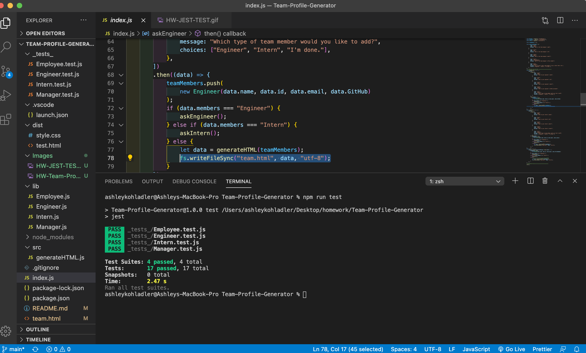

# Team-Profile-Generator

# Table of Contents
  
  1. [Description](#Description)
  2. [Installation](#Installation)
  3. [Usage](#Usage)
  4. [License](#License)
  5. [Contributing](#Contributing)
  6. [Tests](#Tests)
  7. [Questions](#Questions)
  8. [Demo](#Demo)

  # Description 
  This Node.js command-line application that takes in information about employees on a software engineering team, then generates an HTML webpage that displays summaries for each person. 

  # Installation
  The program is run with the command "node index.js"

  # Usage
  When generator starts answer questions prompts to customize team.HTML

  # Contributing
  Contributions are accepted
  

  # License
  
  
  # Tests
  - Jest Test

  

  

  # Questions:
  ## GitHub User name 
  ashleykohladler
  ### Link to GitHub:
  ### To access the website go to https://github.com/ashleykohladler/Team-Profile-Generator

  ### Email address 
  akohl22@gmail.com

  # Demo
  ## Using application from the command line and generating HTML
  

  ## Demo of all 4 tests passing
  

  # Badges

  

  

  
  